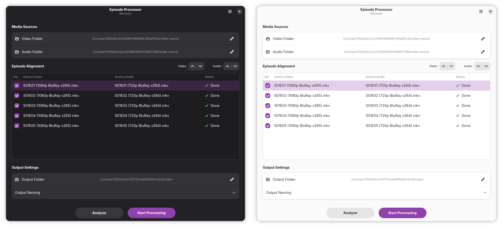

# Remuxer

**Remuxer** is a high-performance batch media muxing tool for Linux. It allows you to effortlessly copy audio tracks from one source to another set of high-quality video files. Built with **GTK4** and **Libadwaita**, it provides a modern interface to manage mass media processing using the power of **FFmpeg** without quality loss (no recoding).

<p align="center">
  
</p>

## 🎯 Who is this for?

**Remuxer** is designed for users who need to swap or attach audio streams across multiple files in bulk, eliminating the tedious process of doing it file-by-file in complex editors or via manual terminal commands

### 🔄 The Workflow

Instead of spending hours processing files individually, Remuxer reduces the entire job to three simple steps:

1. **Select Video Source:** Pick the folder containing your high-quality target video files.
2. **Select Audio Source:** Pick the folder containing the replacement or supplementary audio tracks.
3. **Align & Process:** Use the intuitive table to verify that each video matches its corresponding audio file, hit **Start Processing**, and let FFmpeg stream-copy the entire batch in seconds with **zero quality loss**.

## 🚀 Key Features (SEO)

- **Batch Media Muxing:** Process entire directories of video and audio simultaneously.
- **Zero Quality Loss:** Uses FFmpeg stream copying (no re-encoding) for lightning-fast results.
- **Intuitive Mapping:** Align source and destination files easily using a modern GTK4 ColumnView.
- **Linux Native:** Beautifully integrated with the GNOME ecosystem using Libadwaita.

## 🛠️ Tech Stack

- **Language:** Python 3
- **UI Framework:** GTK4 & Libadwaita (via Blueprint)
- **Processing Engine:** FFmpeg

## 📌 Prerequisites

You must have **FFmpeg** installed on your system.

- **Official Website:** [ffmpeg.org/download.html](https://ffmpeg.org/download.html)
- **Fedora:** `sudo dnf install ffmpeg`
- **Ubuntu/Debian:** `sudo apt install ffmpeg`

## ⚙️ Installation & Running

Follow these steps to clone the repository and run the application in a local environment:

1. **Clone the repository:**

```bash
git clone https://github.com/bymoxb/remuxer.git
cd remuxer
```

2. **Set up a virtual environment:**

```bash
python -m venv venv
source venv/bin/activate  # On Linux
pip install -r requirements.txt
```

3. **Compile Assets (UI & Translations):**
   This project uses Blueprint for the UI and Gettext for translations. Use the provided automation script to generate the necessary files:

```bash
./update-assets.sh
```

4. **Run the application:**

```bash
python main.py
```
